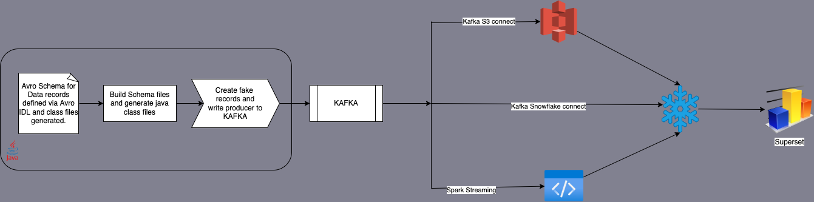

# Apache Avro - Schemas and Custom LogicalTypes

[](https://choosealicense.com/licenses/mit/)
[](https://github.com/anilkulkarni87/AvroJnaana/actions/workflows/gradle.yml)


### AvroJnaana: 
    This name combines "Avro" and "Jnaana" (meaning "knowledge" or "wisdom" in Sanskrit) 
    to suggest a project focused on understanding and mastering the use of logical types in Apache Avro.

This is a companion code repo for the Apache Avro series of articles. The articles will cover the below topics:

- Custom Logical Types
- Apache Avro Schemas
    - QueryRecord
    - CustomerObjectModel
- Building Avrodoc via gradle
- Writing to Avro using Java Faker

Here is the link to the Avrodoc of the schemas that the repo currently has:

### [Avrodoc](./docs/avrodoc/avrodoc.html){:target="_blank"}


## Problem statement

When you define avro schemas or models or contracts for a particular dataset or domain, we have a limited set of data types available.

What if there is a field which needs to be encrypted?
What if there is a field which needs to be transformed in a different way?

[Logical Types](https://avro.apache.org/docs/1.11.1/idl-language/#logical-types) to the rescue.

By defining custom logical types, we can handle such usecases. This code repo has examples of that.

Some of the questions it will help answer right away:
- How to define a Custom Logical type and package it?
- How do we maintain our schemas?
- Better way of sharing schemas with other team members?
- How can we write complex schemas easily?
- How can schemas be made reusable?

## Schemas Used

- QueryRecord schema

  Used for testing.
- CustomerObjectModel

  My take on a generic Customer Model of a retail store.

## Build project

- Clone the repo
- Build project

  `gradle clean build`
- Generate Schema files

  `gradle schemas:generateSchema`

- Build Avrodoc

  `gradle schemas:generateAvroDoc`

  The avro schemas are represented in a html file making it easy to search and understand the schema.

- Run `QueryRecordOutput.java` and verify the logs.

## Testing with Kafka
Read more at [Test with Kafka](./kafka.md)

## Working with Schema Registry
Read more at [Schema Registry](./schema_registry.md)


## Directory Tree
Generated by the command 
```tree -r -I 'node_modules|bin|package*|java_*'```
```
├── src
│   ├── test
│   │   ├── resources
│   │   └── java
│   └── main
│       ├── resources
│       └── java
│           └── com
│               └── lavro
│                   ├── QueryRecordOutput.java
│                   ├── ProducerDemo.java
│                   ├── CustomerObjectModelOutput.java
│                   └── ConsumerDemo.java
├── settings.gradle
├── schemas
│   ├── src
│   │   ├── test
│   │   │   ├── resources
│   │   │   └── java
│   │   └── main
│   │       ├── resources
│   │       ├── java
│   │       │   └── com
│   │       │       └── lavro
│   │       └── avro
│   │           ├── query.avdl
│   │           ├── SimpleOrder.avdl
│   │           ├── SimpleCustomer.avdl
│   │           ├── CustomerObjects.avdl
│   │           └── CustomerObjectModel.avdl
│   └── build.gradle
├── schema-registry
│   └── results
│       └── registered.csv
├── query.avro
├── kafka.md
├── gradlew.bat
├── gradlew
├── gradle
│   └── wrapper
│       ├── gradle-wrapper.properties
│       └── gradle-wrapper.jar
├── docs
│   ├── ecommerce.png
│   ├── ecommerce.drawio
│   └── avrodoc
│       └── avrodoc.html
├── custom-conversions
│   ├── src
│   │   ├── test
│   │   │   ├── resources
│   │   │   └── java
│   │   └── main
│   │       ├── resources
│   │       └── java
│   │           └── com
│   │               └── lavro
│   │                   ├── ReversedLogicalTypeFactory.java
│   │                   ├── ReversedLogicalType.java
│   │                   ├── ReversedConversion.java
│   │                   ├── EncryptedLogicalTypeFactory.java
│   │                   ├── EncryptedLogicalType.java
│   │                   └── EncryptedConversion.java
│   └── build.gradle
├── config
│   ├── xsl
│   │   └── checkstyle-custom.xsl
│   └── checkstyle
│       ├── suppressions.xml
│       └── checkstyle.xml
├── build.gradle
└── README.md


```


## Roadmap

- [x] Add Github workflow for building schemas and avrodoc
- [ ] Add unit tests for Conversions
- [x] Publish To Kafka topic
- [x] Add spotless or checkstyle plugins
- [ ] Fix for fields which are union logicaltype and null
- [x] Schema evolution/ Schema registry plugin
- [ ] Keep the README.md updated
- [ ] Add documentation for Schema compatibility check 




## Tech Stack

**Language:** Java

**Build Tool:** Gradle


## Authors

- [@anilkulkarni](https://github.com/anilkulkarni87)


## Acknowledgements

 - [Awesome Readme Templates](https://readme.so/)
 - [Avrodoc Plus](https://github.com/mikaello/avrodoc-plus)
 - [Gradle Avro Plugin](https://github.com/davidmc24/gradle-avro-plugin)
 - [Gradle Schema registry plugin](https://github.com/ImFlog/schema-registry-plugin)


## 🔗 Links
[](https://anilkulkarni.com/)
[](https://www.linkedin.com/in/anilakulkarni/)


